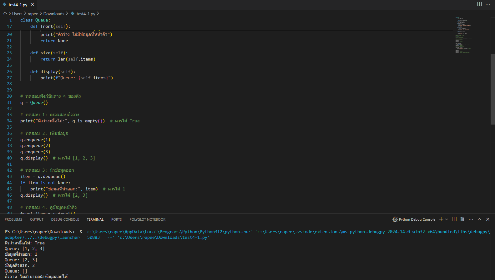
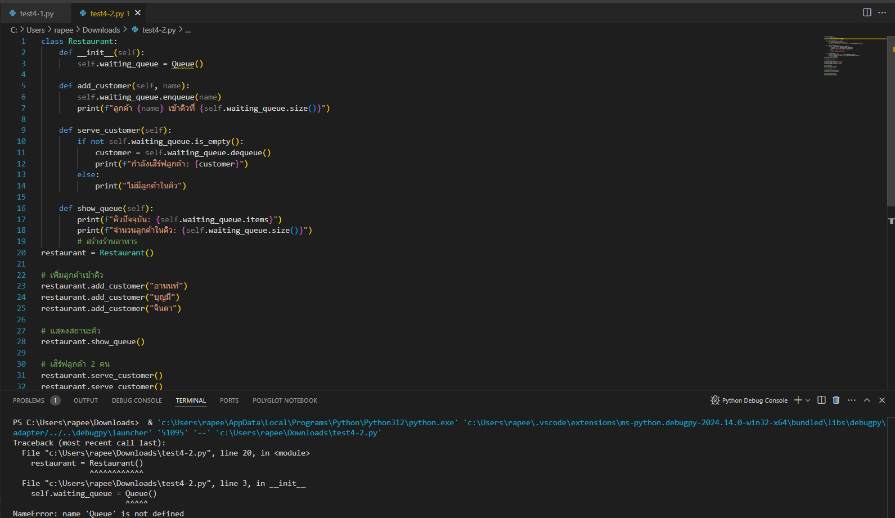

# ใบงานการทดลองที่ 4
## เรื่อง การใช้งานโครงสร้างข้อมูลแบบคิว (Queue) ด้วย Python

### วัตถุประสงค์
1. อธิบายหลักการทำงานของโครงสร้างข้อมูลแบบคิว (Queue) ได้
2. สามารถเขียนโปรแกรมเพื่อสร้างและจัดการคิวด้วย Python ได้
3. ประยุกต์ใช้งานคิวในการเขียนโปรแกรมแก้ไขปัญหาในสถานการณ์จริงได้

### ทฤษฎีที่เกี่ยวข้อง
คิว (Queue) เป็นโครงสร้างข้อมูลแบบ FIFO (First In First Out) คือ ข้อมูลที่เข้ามาก่อนจะถูกนำออกก่อน เปรียบเสมือนการต่อแถวรอรับบริการ

การดำเนินการพื้นฐานของคิว:
- enqueue: เพิ่มข้อมูลเข้าท้ายคิว
- dequeue: นำข้อมูลออกจากหน้าคิว
- front: ดูข้อมูลที่อยู่หน้าคิว
- is_empty: ตรวจสอบว่าคิวว่างหรือไม่
- size: ขนาดของคิว

### อุปกรณ์ที่ใช้
1. เครื่องคอมพิวเตอร์
2. Python 3.x
3. Text Editor หรือ IDE (เช่น VS Code, PyCharm)

### การทดลอง

#### ตอนที่ 1: การสร้างคลาส Queue พื้นฐาน

```python
class Queue:
    def __init__(self):
        self.items = []
    
    def is_empty(self):
        return len(self.items) == 0
    
    def enqueue(self, item):
        self.items.append(item)
    
    def dequeue(self):
        if not self.is_empty():
            return self.items.pop(0)
        return None
    
    def front(self):
        if not self.is_empty():
            return self.items[0]
        return None
    
    def size(self):
        return len(self.items)
    
    def display(self):
        print(f"Queue: {self.items}")
```

**คำสั่ง**: ให้นักศึกษาทดลองใช้คำสั่งต่อไปนี้และบันทึกรูปผลทดลอง

```python
# สร้าง Queue
q = Queue()

# ทดสอบ 1: ตรวจสอบคิวว่าง
print("คิวว่างหรือไม่:", q.is_empty())  # ควรได้ True

# ทดสอบ 2: เพิ่มข้อมูล
q.enqueue(1)
q.enqueue(2)
q.enqueue(3)
q.display()  # ควรได้ [1, 2, 3]

# ทดสอบ 3: นำข้อมูลออก
item = q.dequeue()
print("ข้อมูลที่นำออก:", item)  # ควรได้ 1
q.display()  # ควรได้ [2, 3]

# ทดสอบ 4: ดูข้อมูลหน้าคิว
print("ข้อมูลคิวแรก:", q.front())  # ควรได้ 2
```

| รูปผลการทดลอง |


#### ตอนที่ 2: การประยุกต์ใช้คิวในการจำลองการรอคิวร้านอาหาร

```python
class Restaurant:
    def __init__(self):
        self.waiting_queue = Queue()
        
    def add_customer(self, name):
        self.waiting_queue.enqueue(name)
        print(f"ลูกค้า {name} เข้าคิวที่ {self.waiting_queue.size()}")
        
    def serve_customer(self):
        if not self.waiting_queue.is_empty():
            customer = self.waiting_queue.dequeue()
            print(f"กำลังเสิร์ฟลูกค้า: {customer}")
        else:
            print("ไม่มีลูกค้าในคิว")
            
    def show_queue(self):
        print(f"คิวปัจจุบัน: {self.waiting_queue.items}")
        print(f"จำนวนลูกค้าในคิว: {self.waiting_queue.size()}")
```

**คำสั่ง**: ให้นักศึกษาทดลองจำลองสถานการณ์ร้านอาหารด้วยคำสั่งต่อไปนี้

```python
# สร้างร้านอาหาร
restaurant = Restaurant()

# เพิ่มลูกค้าเข้าคิว
restaurant.add_customer("อานนท์")
restaurant.add_customer("บุญมี")
restaurant.add_customer("จินดา")

# แสดงสถานะคิว
restaurant.show_queue()

# เสิร์ฟลูกค้า 2 คน
restaurant.serve_customer()
restaurant.serve_customer()

# แสดงสถานะคิวอีกครั้ง
restaurant.show_queue()
```

| รูปผลการทดลอง |


### แบบฝึกหัด
1. ให้เพิ่มเมธอด `clear()` ในคลาส Queue เพื่อล้างข้อมูลทั้งหมดในคิว
2. ให้เพิ่มเมธอด `peek_last()` ในคลาส Queue เพื่อดูข้อมูลตัวสุดท้ายในคิวโดยไม่นำออก
3. ตัวอย่างการประยุกต์ใช้คิวในการจำลองการรอคิวร้านอาหาร จะเกิดความผิดพลาดในการทำงานกรณีใด จงอธิบาย และจะแก้ไข Code อย่างไรเพื่อแก้ไขปัญหาดังกล่าว (สร้างไฟล์ใหม่ ตั้งขื่อ UpdateQueueRestaurant.py)
4. ประยุกต์ใช้คิวในการจำลองระบบคิวธนาคาร โดยมีฟังก์ชันการทำงานดังนี้:
   - เพิ่มลูกค้าเข้าคิว พร้อมประเภทธุรกรรม (ฝาก/ถอน/ชำระบิล)
   - เรียกลูกค้าเข้ารับบริการ
   - แสดงจำนวนคิวที่รอ
   - แสดงประมาณการเวลารอ (สมมติว่าธุรกรรมใช้เวลาเฉลี่ย 5 นาที/คน)
   - 
5. จงเขียนโปรแกรมจำลองระบบจัดการคิวร้านตัดผม โดยมีความสามารถดังนี้:
   - เพิ่มลูกค้าเข้าคิว พร้อมระบุบริการที่ต้องการ (ตัดผม, สระ, ย้อมสี)
   - แสดงรายชื่อลูกค้าที่รออยู่ในคิว
   - เรียกลูกค้าคนถัดไป
   - แสดงเวลารอโดยประมาณ (ตัดผม 30 นาที, สระ 20 นาที, ย้อมสี 60 นาที)

    ตัวอย่างผลลัพธ์:
    ```
    === ร้านตัดผมคุณหรีด ===
    1. เพิ่มลูกค้า: สมชาย (ตัดผม)
    2. เพิ่มลูกค้า: สมหญิง (ย้อมสี)
    แสดงคิว: 
    1. สมชาย - ตัดผม (รอประมาณ 30 นาที)
    2. สมหญิง - ย้อมสี (รอประมาณ 90 นาที)
    เรียกลูกค้า: สมชาย
    คิวที่เหลือ:
    1. สมหญิง - ย้อมสี (รอประมาณ 60 นาที)
    ```

### คำถามท้ายการทดลอง
1. Queue ต่างจาก Stack อย่างไร?
2. เพราะเหตุใดการ dequeue จึงใช้ pop(0) แทนที่จะเป็น pop()?
3. ยกตัวอย่างการประยุกต์ใช้ Queue ในชีวิตประจำวันมา 3 ตัวอย่าง
4. หากต้องการทำ Priority Queue จะต้องปรับปรุงโค้ดอย่างไร?


### การส่งงาน
1. ส่งไฟล์ .py ที่มีโค้ดการทดลองทั้งหมด
2. คำตอบคำถามท้ายการทดลอง


### เอกสารอ้างอิง
1. Python Documentation - [https://docs.python.org/3/](https://docs.python.org/3/)
2. Data Structures and Algorithms in Python - Goodrich, Tamassia & Goldwasser

---
